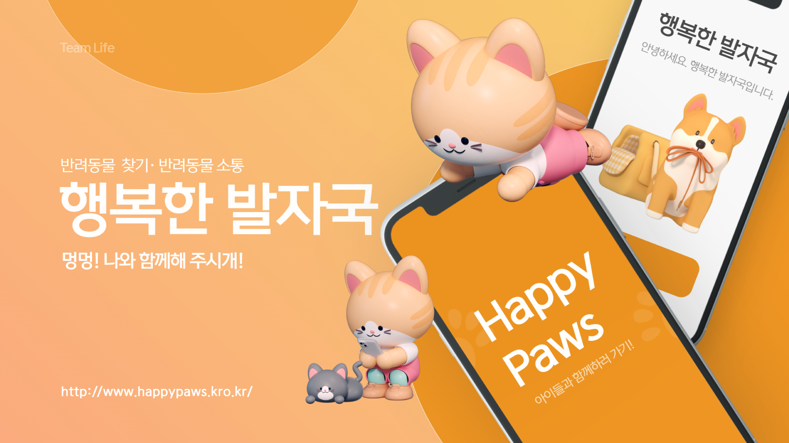
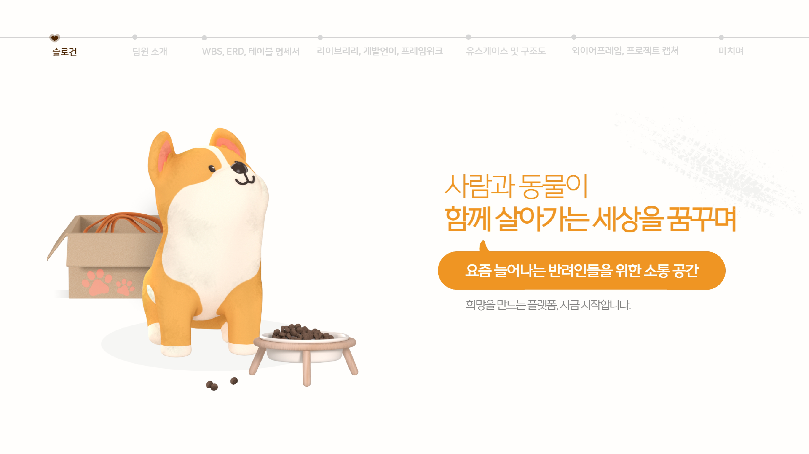
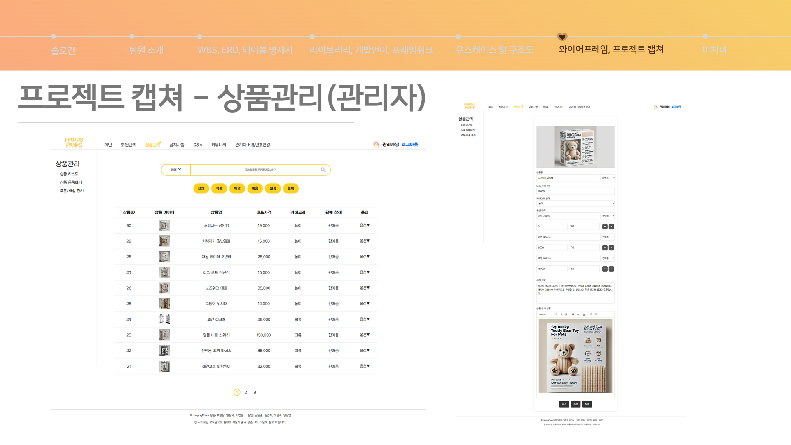

# 행복한 발자국 🐾
## 유기동물 입양 플랫폼, 행복한 발자국입니다.





### 담당 기능
> 관리자 상품 관리 기능 구현



### 🔧 구현 내용
- 썸네일 이미지 업로드 및 서버 저장 (UUID로 파일명 중복 방지)
- 상품 옵션 등록/수정/삭제
- MyBatis 기반 DAO, 페이징 처리
- 상품 등록/수정 화면 JSP, 파일 처리 및 리디렉션 처리


### 📁 구현 파일
```
src/
├── main/
│   ├── java/com/happypaws/
│   │   ├── life/
│   │   │   └── AdminProductController.java  ← 기능 흐름 제어, 파일 업로드, 등록/수정/삭제 요청 처리
│   │   ├── svc/
│   │   │   └── AdminProductSVC.java         ← 비즈니스 로직 처리, DAO 연결
│   │   ├── dao/
│   │   │   └── AdminProductDAO.java         ← DB 연동(MyBatis), 상품 및 옵션 CRUD
│   │   └── vo/
│   │       ├── ProductsVO.java              ← 상품 정보 모델 (이름, 설명, 카테고리, 썸네일 등)
│   │       └── ProductOptionVO.java         ← 상품 옵션 정보 모델 (이름, 재고, 가격, 상태 등)
│
├── resources/
│   ├── mapper/
│   │   └── AdminProductMapper.xml           ← SQL 정의 (등록/조회/삭제 등)
│   └── oauth.properties
│
├── webapp/WEB-INF/admin_product/
│   ├── admin_product_add.jsp                ← 상품 등록 폼
│   ├── admin_product_list.jsp               ← 상품 목록 조회 및 페이징
│   └── admin_product_modify.jsp             ← 상품 수정 폼
```

## 💻 사용 기술

### 언어
- Java, HTML5, CSS3, JavaScript

### 프레임워크 및 라이브러리
- Spring Framework (v5.3.9)
- MyBatis, Spring JDBC
- Apache Commons DBCP, FileUpload, IO

### 서버 & DB
- Apache Tomcat9
- MariaDB, MySQL
- AWS

### 도구
- STS, VS Code, HeidiSQL, Figma

### 📄 전체 문서
전체 기획안은 `images/` 폴더에서 확인할 수 있습니다.
